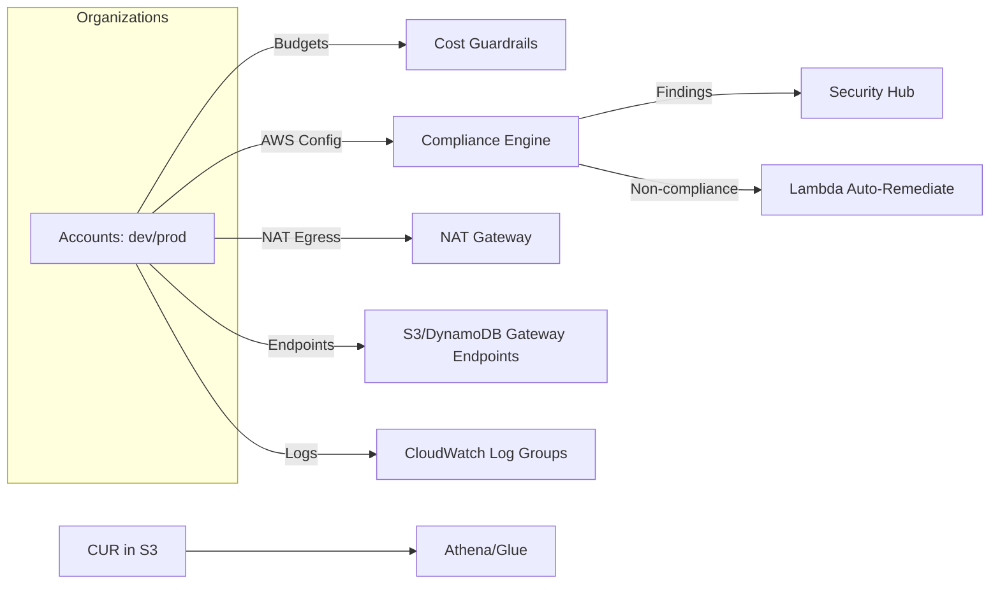

# AWS Cost & Compliance Automation — Starter Project

This project is designed to showcase the exact skills for a **Cloud Cost Optimization + Compliance Automation** role.
It deploys:
- **Cost visibility & guardrails**: AWS Budgets per tag, basic S3 lifecycle policies, NAT cost reductions (S3/DynamoDB Gateway Endpoints), log retention reminders.
- **Compliance automation**: AWS Config required-tags rule **with auto-remediation** (Lambda), Security Hub enablement.
- **Athena queries** for CUR analysis (plug in your existing CUR bucket).

> **Timebox**: You can demo a working MVP in a weekend. Expand with Terragrunt and dashboards as a stretch.

---

## Architecture (Mermaid)


## What you’ll demo
1. **Tag Enforcement**: Create a resource without required tags → Config marks non-compliant → Lambda adds missing tags (owner/app/env) and posts details to logs.
2. **Cost Guardrails**: Budget alert per application tag; S3 lifecycle policy on a demo bucket; VPC Gateway Endpoints to cut NAT egress.
3. **Security Baseline**: Enable Security Hub + CIS standard.
4. **CUR/Athena**: Run provided SQL to show Top-10 services this month.

---

## Prereqs
- Terraform ≥ 1.6, AWS CLI configured, Python 3.10+, Node 18+ (for TypeScript Lambda), and an AWS account.
- (Optional) Existing **Cost & Usage Report** (CUR) delivered to S3. If not, create one from Billing Console (Athena-ready).

## Quickstart
```bash
# 1) Go to the example stack
cd terraform/examples/simple

# 2) Initialize & apply (this creates: Budgets, Config rule+remediation, SecurityHub, VPC Endpoints)
terraform init
terraform apply -auto-approve

# 3) Deploy Lambda code (uses zip + Terraform module variables)
#    NOTE: For the starter, the Terraform module builds from local zip artifacts.
cd ../../..
bash scripts/build_and_package.sh

# 4) Re-apply Terraform to update function code (if needed)
cd terraform/examples/simple
terraform apply -auto-approve

# 5) Athena CUR queries (if you have CUR in S3):
cd ../../sql
# open the .sql files in the Athena console, set workgroup/output, and run
```

## Clean up
```bash
cd terraform/examples/simple
terraform destroy -auto-approve
```

## Stretch goals
- Add **Datadog** monitors for budget breaches and Config findings via EventBridge → Lambda → Datadog API.
- Add **QuickSight or Superset** dashboard for savings opportunities and compliance trend.
- Convert to **Terragrunt** with `live/dev`, `live/prod`, and a `modules/` catalog.
